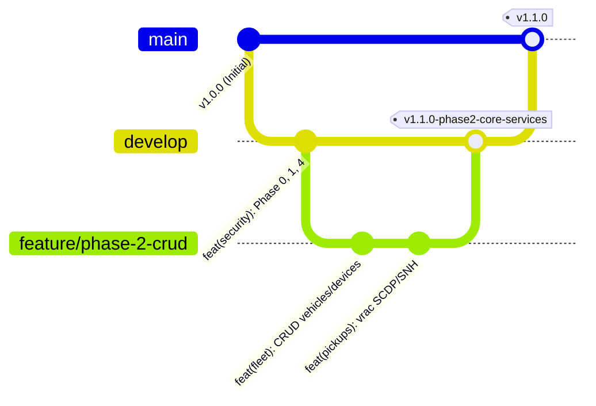

# 📌 Guide de Versionnement et Stratégie Git — GPL-RFID Backend

Ce document définit la stratégie officielle de gestion de versions (Semantic Versioning), de gestion des branches (GitFlow adaptation) et des conventions de commits pour l'ensemble de l'équipe et des agents AI sur le projet **GPL-RFID Backend**.

---

## 🔀 1. Modèle de Branches (GitFlow)

Le projet suit la stratégie **GitFlow** avec deux branches permanentes :

### Branches Permanentes
- **`main`** (ou `master`) : Branche de **production**. Chaque commit sur `main` correspond à une version stable déployable, obligatoirement marquée par un **Tag de release** (ex: `v1.0.0`, `v1.1.0`).
- **`develop`** : Branche principale d'**intégration et de développement**. **TOUT LE TRAVAIL EN COURS DOIT ÊTRE FAIT SUR CETTE BRANCHE** (ou fusionné dessus via des branches feature).

### Branches Temporaires
- **`feature/<nom-de-la-fonctionnalité>`** : Branche créée depuis `develop` pour développer un module ou une fonction métier spécifique (ex: `feature/tour-lifecycle`, `feature/subsidies-calculation`). Rejoint `develop` via Pull Request / Merge.
- **`release/vX.Y.Z`** : Branche de préparation d'une mise en production (stabilisation, derniers tests).
- **`hotfix/<description>`** : Branche créée depuis `main` pour corriger un bug critique en production, puis réinjectée dans `main` ET `develop`.

---

## 🏷️ 2. Convention de SemVer (Semantic Versioning)

Le format des numéros de version est **`vMAJOR.MINOR.PATCH[-PRERELEASE]`** :

$$\text{Version} = v\text{MAJOR}.\text{MINOR}.\text{PATCH}$$

- **MAJOR** (ex: `v2.0.0`) : Changements majeurs incompatibles ou refonte d'architecture critique.
- **MINOR** (ex: `v1.1.0`) : Ajout de fonctionnalités métier rétrocompatibles (ex: fin d'une Phase du roadmap : Phase 2, Phase 3).
- **PATCH** (ex: `v1.1.1`) : Corrections de bugs (bugfixes) ou ajustements mineurs rétrocompatibles.

### Historique des Tags Existants
- **`v1.0.0-phase4-security`** (commit `01153c0`) : Socle de sécurité RBAC (`@RequiresPermission`, JWT claims, Gateway headers).
- **`v1.1.0-phase2-core-services`** (commit `c563ef6`) : Intégration complète des CRUDs métier (`fleet`, `cylinder`, `subsidy`, `org`, `user`, `pickups`).

---

## 💬 3. Convention de Commits (Conventional Commits)

Chaque message de commit doit respecter la structure suivante :

$$\text{type}(\text{scope}): \text{description courte en minuscules}$$

### Types autorisés :
- `feat` : Nouvelle fonctionnalité métier (ex: `feat(pickups): add bulk depot pickup request workflow`)
- `fix` : Correction d'un bug (ex: `fix(auth): correct roles deserialization in refresh token`)
- `refactor` : Modification du code qui ne corrige ni ne rajoute de fonction (ex: `refactor(common): optimize security context filter`)
- `docs` : Documentation uniquement (ex: `docs(git): add versioning guide`)
- `style` : Formattage du code, absence d'impact logique
- `test` : Ajout ou modification de tests unitaires/d'intégration
- `chore` : Tâches de maintenance (ex: pom.xml dependencies update, maven plugins)

---

## 🤖 4. Directives Strictes pour les Agents AI (Antigravity & Peer Agents)

> [!IMPORTANT]
> **RÈGLES D'OR CONSERVÉES EN MÉMOIRE POUR TOUTES LES CONVERSATIONS FUTURES :**
> 1. **Toujours vérifier la branche courante** (`git branch`) avant toute modification.
> 2. **Toujours travailler sur la branche `develop`** (ou une branche `feature/*`). Ne JAMAIS commiter directement sur `main` sauf lors d'une release officielle.
> 3. **Commiter chaque fin de phase** avec un message respectant les Conventional Commits et apposer le Tag SemVer correspondant.
> 4. **Toujours exécuter `mvn clean compile -DskipTests`** et valider le **BUILD SUCCESS sur les 13 microservices** avant de commiter ou de créer un tag.
